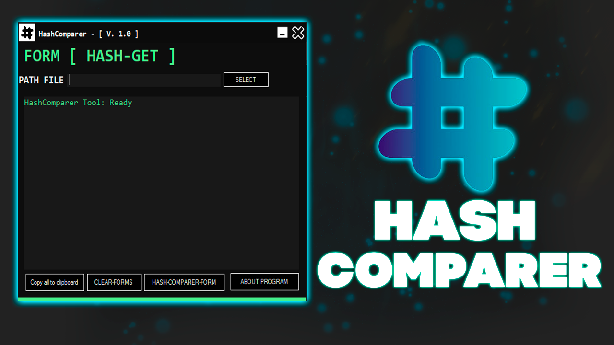
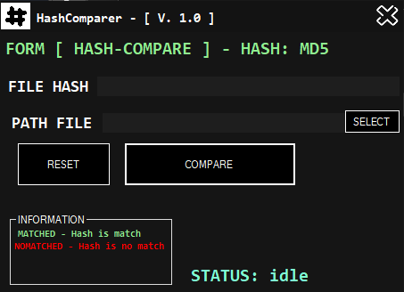
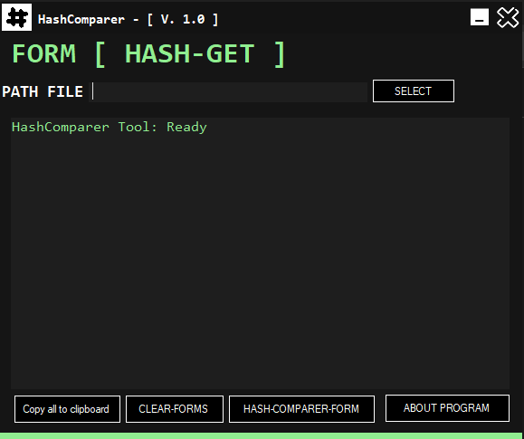

# HashComparer

## 📑 About
</b>HashTool</b>
<strong>This is a simple tool for obtaining a file hash and also comparing it.</strong>

## 💻 Screens

  
  

 

### 🤖 Alogrithms:
 * MD5
 * SHA1
 * SHA256
 * CRC32

## ✨ End
<strong>Thanks for watching this repository!</strong>